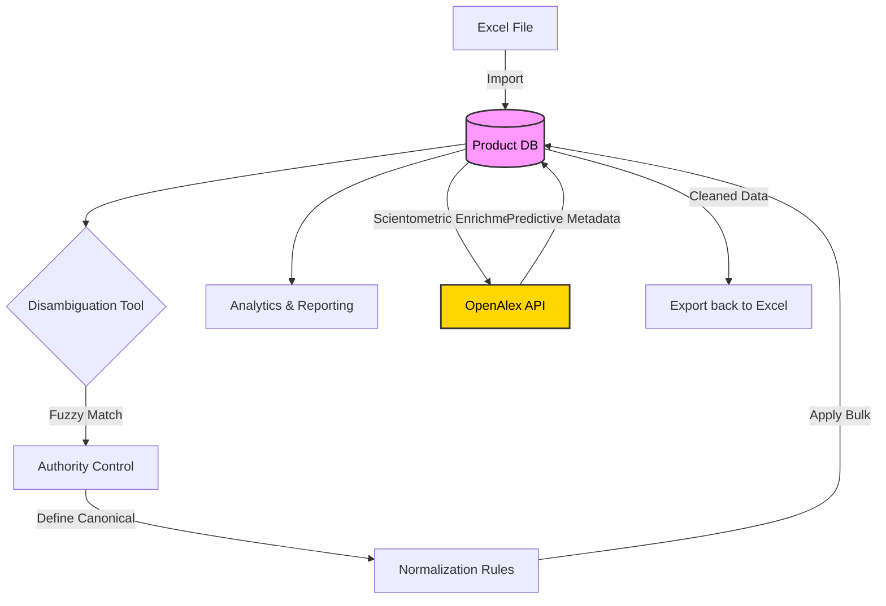

<div align="center">

# 🗄️ DB Disambiguator

**A Powerful Full-Stack Tool for E-commerce & Product Catalog Data Hygiene**

[](https://www.python.org/)
[](https://fastapi.tiangolo.com/)
[](https://react.dev/)
[](https://nextjs.org/)
[](https://tailwindcss.com/)
[](LICENSE)

*Import, browse, and clean your product catalog data with ease. Detect inconsistencies in key fields using fuzzy string matching and establish authority-control workflows to normalize values across your entire database.*

[Explore Features](#-features) • [Getting Started](#-quick-start) • [Documentation](#-api-overview) • [Roadmap](#-roadmap)

</div>

---

## 🎯 Why DB Disambiguator?

The primary goal of this project is to be **easy to understand, deploy, and use**. Data cleaning can be tedious, especially when dealing with e-commerce catalogs where vendors submit data in varying formats (e.g., "Nike", "nike inc", "NIKE", "Nike, Inc.").

**DB Disambiguador** provides a visual interface to:
1. **Spot the mess**: Catch typos and variations using fuzzy matching.
2. **Define the truth**: Select the correct "canonical" value.
3. **Clean the database**: Apply rules to update thousands of records instantly.

### 🧠 Design Philosophy: Pragmatic & Accessible
As detailed in our [Architecture Documentation](docs/ARCHITECTURE.md), this codebase governs itself by one rule: **Justified Complexity**. 
- We avoid over-engineering and premature abstractions.
- The repository is structured as a straightforward **Monorepo** (FastAPI + Next.js).
- If something can be solved with a simple dictionary instead of a complex library, we use the dictionary.

*The codebase is intentionally structured to be accessible for beginners and junior developers, while remaining robust enough for production data hygiene tasks. You won't find spaghetti code, but you also won't find unnecessary "astronaut architecture".*

---

## ✨ Features

- 📦 **Interactive Product Catalog**
  Browse, search, inline-edit, and delete product records. Features dynamic pagination (10-100 rows) and distinct structured fields for SKU/GTIN.
- 📥 **Native Excel Import & Export**
  Seamlessly upload `.xlsx` files while preserving the original column formats. Export cleaned & filtered data back to Excel.
- 🔍 **Fuzzy Data Disambiguation**
  Leverages advanced string matching algorithms (`token_sort_ratio` & `Levenshtein`) to group typos, different casings, and synonyms effortlessly.
- 🛡️ **Authority Control & Rules Engine**
  Define canonical values, create bulk normalization rules, and efficiently process large variation groups using optimized client-side pagination.
- 📊 **Real-time Analytics Dashboard**
  Gain insights with key metrics: total products, unique brands/models, validation status, identifier coverage, and more.
- 🔬 **Data Source Multi-format Pre-Analyzer**
  Preview complex structures natively before ingestion via Drag-and-Drop. Compatible with abstract models like *JSON-LD, deeply-nested XMLs, RDF triples, and Parquet Dataframes*.
- 🔮 **Predictive Scientometric Enrichment** *(New!)*
  Background worker architecture that fetches key scientific indicators (e.g., citation rates, semantic topics, machine learning concepts) by mapping your catalog against big-data indexers.
  - **Active Tier 1:** OpenAlex API integration via a politely rate-limited custom Python worker.
  - **Upcoming Tiers:** PubMed, Web of Science (WoS), Scopus, Google Scholar, and Altmetric APIs natively built-in through a modular *Bring Your Own Key* adapter.
- 🧹 **Database Purge**
  Easily reset your environment by wiping all records (with optional rule cleanup).

---

## 💻 Tech Stack

Our stack is carefully chosen to provide high performance, excellent developer experience, and scalability.

### Backend Engine
- **Language**: Python 3.10+
- **Framework**: FastAPI (High-performance API)
- **Database**: SQLite with SQLAlchemy ORM
- **Matching Engine**: `thefuzz` + `python-Levenshtein`

### Frontend Application
- **Framework**: Next.js 16 (App Router)
- **UI Library**: React 19
- **Language**: TypeScript 5
- **Styling**: Tailwind CSS 4

---

## 🚀 Quick Start

Get the project up and running on your local machine in just a few simple steps.

### Prerequisites

Ensure you have the following installed:
- [Python 3.10+](https://www.python.org/downloads/)
- [Node.js 18+](https://nodejs.org/) & npm 9+

### 1. Clone the repository

```bash
git clone https://github.com/<your-user>/DBDesambiguador.git
cd DBDesambiguador
```

### 2. Set up Backend

```bash
# Create and activate virtual environment
python -m venv .venv

# Windows
.venv\Scripts\activate
# macOS / Linux
source .venv/bin/activate

# Install dependencies
pip install -r requirements.txt

# Start the API server
uvicorn backend.main:app --reload
```
*The API should now be running at `http://localhost:8000`*

### 3. Set up Frontend

```bash
cd frontend
npm install
npm run dev
```
*Open **[http://localhost:3004](http://localhost:3004)** in your browser to view the application.*

---

## 🔄 Workflow Architecture

Our system is designed around a continuous improvement loop for your data.



---

## 🗺️ Roadmap

We are constantly improving **DB Disambiguator**. Here is what's coming next:

- [x] **Core Catalog Functionality**: CRUD operations, fuzzy match logic.
- [x] **Advanced Authority Control**: Bulk rules and client-side pagination.
- [x] **Analytics Dashboard**: Deep dive into dataset health.
- [ ] **Machine Learning Matcher**: Integrate embedding-based recommendations for semantic matches.
- [ ] **Multi-Database Support**: Expand support from SQLite to PostgreSQL and MySQL.
- [ ] **Authentication & RBAC**: User accounts, SSO integration, and role-based permissions to protect catalog data.
- [ ] **Scheduled Imports**: Automate ingestion from S3 buckets or external APIs.

---

## 🏗️ Project Structure

<details>
<summary>Click to expand folder structure</summary>

```text
DBDesambiguador/
├── backend/                # FastAPI logic, models & DB setup
├── frontend/               # Next.js UI, styles & components
├── scripts/                # Utility CLI tooling (analysis/import)
├── data/                   # Default storage for .xlsx imports
├── docs/                   # Detailed API & Contribution docs
└── README.md               # You are here!
```
</details>

---

## 🔌 API Overview

The backend exposes a highly documented REST API. Interactive documentation is available at `/docs` *(Swagger UI)* and `/redoc`.

| Method   | Endpoint                | Description                          |
|----------|-------------------------|--------------------------------------|
| `GET`    | `/products`             | List products (search, pagination)   |
| `POST`   | `/upload`               | Import Excel file                    |
| `GET`    | `/disambiguate/{field}` | Get fuzzy-match groups for a field   |
| `GET`    | `/authority/{field}`    | Get disambiguation + rule annotations|
| `POST`   | `/rules/apply`          | Apply normalization rules to the DB  |
| `GET`    | `/stats`                | Retrieve aggregated system stats     |
| `POST`   | `/enrich/row/{id}`      | Triggers Single Row API Enrichment   |
| `POST`   | `/enrich/bulk`          | Queues Bulk Records for Enrichment   |

*For the complete API reference, check out [docs/API.md](docs/API.md). For Predictive Analytics and API integrations, please read our [Scientometric Integration Strategy](docs/SCIENTOMETRICS.md).*

---

## 🤝 Contributing

We welcome contributions! Please see our [Contributing Guidelines](docs/CONTRIBUTING.md) to learn how to propose bugfixes, new features, and improvements to the project.

## 📄 License

This project is open-source and available under the **[Apache License 2.0](LICENSE)**.
